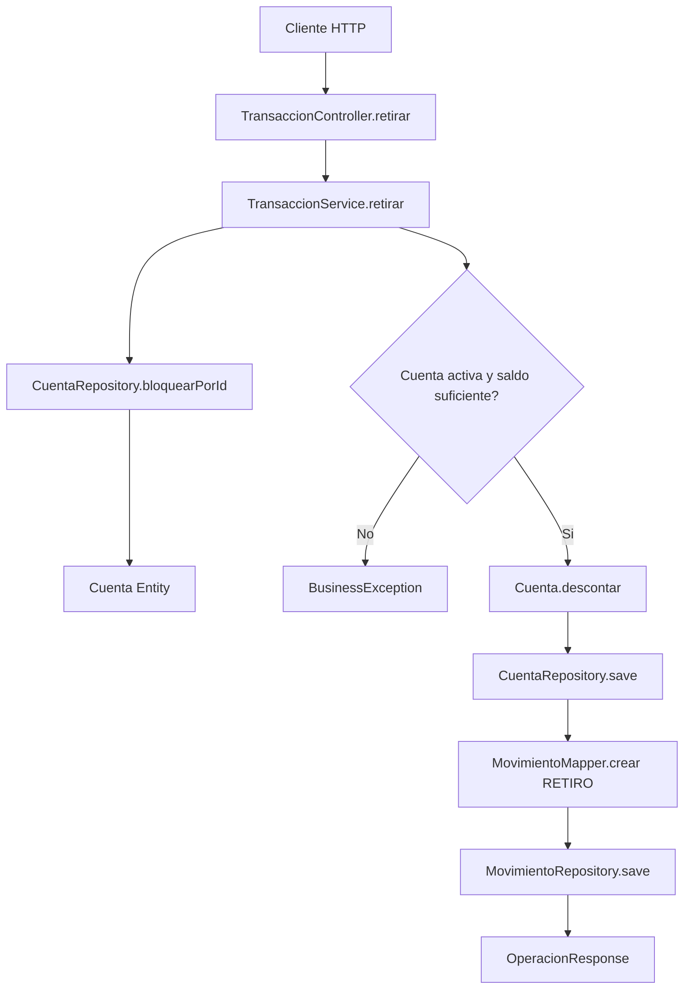
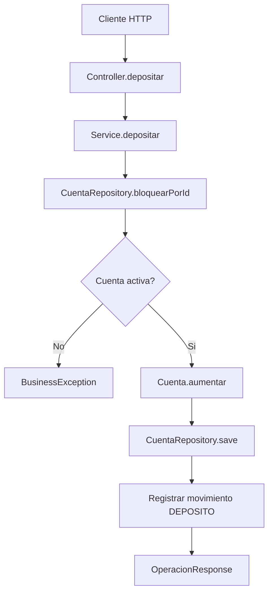
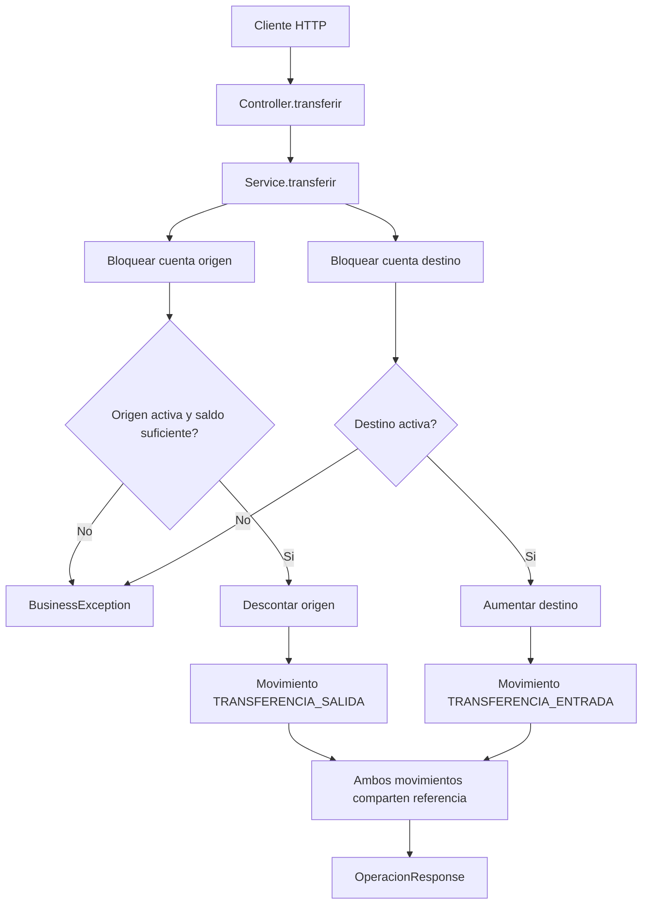
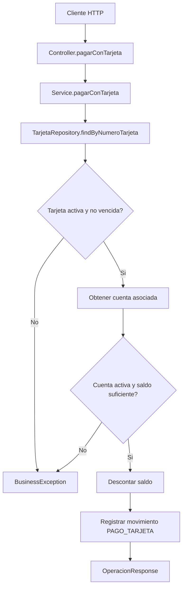
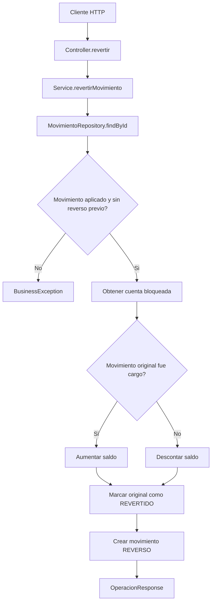

# Flujos principales

## Retiro

```mermaid
flowchart TD
A[Cliente HTTP] --> B[TransaccionController.retirar]
B --> C[TransaccionService.retirar]
C --> D[CuentaRepository.bloquearPorId]
D --> E[Cuenta Entity]
C --> F{Cuenta activa y saldo suficiente?}
F -- No --> G[BusinessException]
F -- Si --> H[Cuenta.descontar]
H --> I[CuentaRepository.save]
I --> J[MovimientoMapper.crear RETIRO]
J --> K[MovimientoRepository.save]
K --> L[OperacionResponse]
```

## Depósito

```mermaid
flowchart TD
A[Cliente HTTP] --> B[Controller.depositar]
B --> C[Service.depositar]
C --> D[CuentaRepository.bloquearPorId]
D --> E{Cuenta activa?}
E -- No --> F[BusinessException]
E -- Si --> G[Cuenta.aumentar]
G --> H[CuentaRepository.save]
H --> I[Registrar movimiento DEPOSITO]
I --> J[OperacionResponse]
```

## Transferencia

```mermaid
flowchart TD
A[Cliente HTTP] --> B[Controller.transferir]
B --> C[Service.transferir]
C --> D[Bloquear cuenta origen]
C --> E[Bloquear cuenta destino]
D --> F{Origen activa y saldo suficiente?}
E --> G{Destino activa?}
F -- No --> H[BusinessException]
G -- No --> H
F -- Si --> I[Descontar origen]
G -- Si --> J[Aumentar destino]
I --> K[Movimiento TRANSFERENCIA_SALIDA]
J --> L[Movimiento TRANSFERENCIA_ENTRADA]
K --> M[Ambos movimientos comparten referencia]
L --> M
M --> N[OperacionResponse]
```

## Pago con tarjeta

```mermaid
flowchart TD
A[Cliente HTTP] --> B[Controller.pagarConTarjeta]
B --> C[Service.pagarConTarjeta]
C --> D[TarjetaRepository.findByNumeroTarjeta]
D --> E{Tarjeta activa y no vencida?}
E -- No --> F[BusinessException]
E -- Si --> G[Obtener cuenta asociada]
G --> H{Cuenta activa y saldo suficiente?}
H -- No --> F
H -- Si --> I[Descontar saldo]
I --> J[Registrar movimiento PAGO_TARJETA]
J --> K[OperacionResponse]
```

## Reverso

```mermaid
flowchart TD
A[Cliente HTTP] --> B[Controller.revertir]
B --> C[Service.revertirMovimiento]
C --> D[MovimientoRepository.findById]
D --> E{Movimiento aplicado y sin reverso previo?}
E -- No --> F[BusinessException]
E -- Si --> G[Obtener cuenta bloqueada]
G --> H{Movimiento original fue cargo?}
H -- Si --> I[Aumentar saldo]
H -- No --> J[Descontar saldo]
I --> K[Marcar original como REVERTIDO]
J --> K
K --> L[Crear movimiento REVERSO]
L --> M[OperacionResponse]
```
